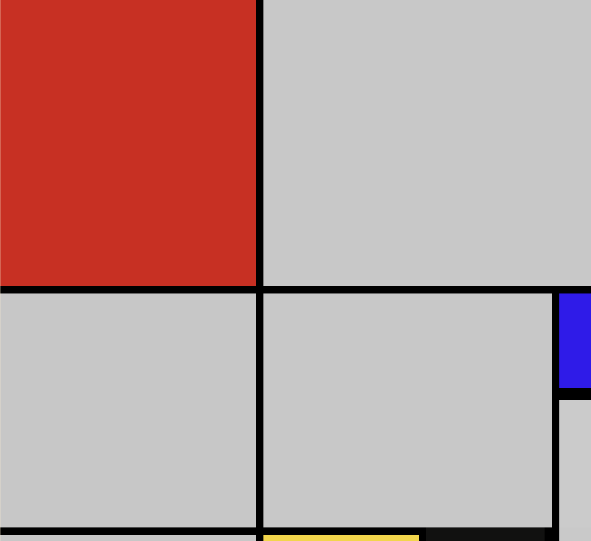

                     ✨ FIGMA Exercise : Grid Reproduction Inspired by Piet Mondrian ✨





## ✏️Description
Ce projet consiste à reproduire une œuvre de Piet Mondrian, célèbre pour ses compositions géométriques en utilisant des lignes et des couleurs primaires, avec une méthode de grille. L'objectif de cet exercice est de recréer l'image de l'artiste en appliquant une grille CSS pour obtenir un résultat pixel perfect. Ce projet n'est pas responsive, mais il permet d'explorer l'utilisation des outils de base du HTML et du CSS, tout en apprenant à appliquer des techniques de design basées sur des grilles.

## 💻 Technologies utilisées

**HTML5** : Pour structurer le contenu de la page.

**CSS3** : Pour appliquer les styles visuels, notamment la mise en place de la grille.

## Caractéristiques principales 🚀
🎯 Design pixel-perfect : Reproduction exacte de l'œuvre de Piet Mondrian à l'aide d'une grille CSS, avec une attention particulière aux proportions et à la disposition des éléments.

🎨 Reproduction inspirée par Piet Mondrian : Représentation géométrique et colorée, utilisant les principes de composition de Mondrian.

🧑‍🏫 Approfondissement des concepts de Grid Layout : L'accent est mis sur l'utilisation d'une grille pour structurer le design et respecter les proportions des éléments.

📚 Apprentissage des bases HTML & CSS : Idéal pour les débutants souhaitant comprendre les bases du design avec les grilles.

## 🛠️ Installation & Utilisation

1. Cloner le dépôt :
```
git clone https://github.com/BertrandM22/figmaV2.git
```

2. Ouvrir le projet : Ouvre le fichier index.html dans ton navigateur préféré pour voir le projet.
